# 🚀 TUIC + Hysteria2 + Reality Proxy Service

<div align="center">


**一个基于 sing-box 的多协议网络代理服务**

支持 TUIC、Hysteria2 和 Reality 协议，具有自动重启和缓存清理功能

[功能特性](#-功能特性) • [快速开始](#-快速开始) • [配置说明](#-配置说明) •
[部署指南](#-部署指南)

</div>

---

## ✨ 功能特性

### 🎯 多协议支持

- **TUIC** - 基于 QUIC 的代理协议，支持拥塞控制 (BBR)
- **Hysteria2** - 高速 UDP 代理，支持伪装功能
- **Reality** - VLESS 协议配合 TLS 混淆

### 🔄 智能管理

- **自动重启** - 北京时间每日 00:03 自动重启清理缓存
- **持久化配置** - UUID 和密钥对自动生成并持久保存
- **架构自适应** - 自动检测并下载对应架构的二进制文件

### 🔒 安全特性

- **TLS 证书** - 自签名证书管理
- **权限控制** - 敏感文件使用 600 权限保护
- **进程管理** - 完善的 PID 跟踪和平滑重启

### 🌍 IPv6 支持

- **Cloudflare WARP 集成** - 通过 masque-plus 代理转发到 Cloudflare WARP
- **IPv4 到 IPv6 转换** - 解决 VPS 缺少 IPv6 地址的问题
- **自动路由配置** - 智能路由 IPv6 流量通过 WARP 网络

### 📊 订阅生成

- **客户端配置** - 自动生成各协议客户端配置 URL
- **Base64 编码** - 标准订阅格式输出
- **ISP 信息** - 包含服务商信息标识

---

## 🚀 快速开始

### 环境要求

- **Node.js** 18 或更高版本
- **Linux/Unix** 系统
- **内存** 128MB 以上
- **网络** 出站网络连接

### 安装运行

```bash
# 克隆项目
git clone https://github.com/masx200/singbox-nodejs.git
cd singbox-nodejs

# 启动服务
npm start
```

### Docker 部署

```bash
# 构建镜像
docker build -t singbox-nodejs .

# 运行容器
docker run -d --name singbox-proxy \
  -p 20143:20143/udp \
  -p 20143:20143/tcp \
  singbox-nodejs
```

---

## ⚙️ 配置说明

### 环境变量

| 变量名         | 说明               | 默认值    |
| -------------- | ------------------ | --------- |
| `TUIC_PORT`    | TUIC 协议端口      | 空 (禁用) |
| `HY2_PORT`     | Hysteria2 协议端口 | 空 (禁用) |
| `REALITY_PORT` | Reality 协议端口   | `20143`   |

### 端口配置示例

```bash
# 启用所有协议使用同一端口
export REALITY_PORT=20143
export HY2_PORT=20143
export TUIC_PORT=

# 不同端口配置
export REALITY_PORT=443
export HY2_PORT=8443
export TUIC_PORT=10000
```

---

## 📁 项目结构

```
singbox-nodejs/
├── index.js              # 主程序入口
├── package.json          # 项目配置
├── warp.sh              # WARP 代理工具下载和配置
├── start.sh             # 主服务配置脚本
├── h3_fingerprint.go    # HTTP/3 证书指纹工具
├── go.mod               # Go 模块依赖
├── .gitignore           # Git 忽略规则
├── README.md            # 项目文档
└── .npm/                # 运行时目录 (自动创建)
    ├── uuid.txt         # UUID 持久存储
    ├── key.txt          # Reality 密钥对存储
    ├── config.json      # sing-box 配置文件
    ├── list.txt         # 订阅 URL 列表
    └── sub.txt          # Base64 编码订阅
```

---

## 🛠️ 开发指南

### 本地开发

```bash
# 安装依赖
npm install

# 启动开发服务
npm start

# 编译指纹工具
go build -o h3_fingerprint h3_fingerprint.go

# 测试证书指纹
./h3_fingerprint
```

### 配置验证

```bash
# 检查 sing-box 配置
.npm/sing-box check -c .npm/config.json

# 查看订阅链接
cat .npm/list.txt

# 查看进程状态
ps aux | grep sing-box
```

---

## 🌐 协议配置

### TUIC 配置

```json
{
  "type": "tuic",
  "listen": "::",
  "listen_port": 10000,
  "congestion_control": "bbr",
  "auth_timeout": "3s",
  "idle_timeout": "1m"
}
```

### Hysteria2 配置

```json
{
  "type": "hysteria2",
  "listen": "::",
  "listen_port": 8443,
  "masquerade": {
    "type": "proxy",
    "proxy": {
      "url": "https://www.bing.com"
    }
  }
}
```

### Reality 配置

```json
{
  "type": "vless",
  "listen": "::",
  "listen_port": 443,
  "tls": {
    "enabled": true,
    "server_name": "www.bing.com",
    "reality": {
      "enabled": true,
      "handshake": {
        "server": "www.bing.com",
        "server_port": 443
      }
    }
  }
}
```

---

## 🌐 IPv6 解决方案

### 问题背景

许多 VPS 提供商不提供 IPv6 地址，或者 IPv6 网络不稳定，这限制了对 IPv6-only
服务的访问能力。

### 解决方案架构

本服务通过集成 **Cloudflare WARP** 代理来解决 IPv6 连接问题：

```mermaid
graph LR
    A[客户端] --> B[IPv4 VPS]
    B --> C[sing-box 代理]
    C --> D[masque-plus]
    D --> E[Cloudflare WARP]
    E --> F[IPv6 目标服务]

    style A fill:#e1f5fe
    style B fill:#fff3e0
    style C fill:#f3e5f5
    style D fill:#e8f5e8
    style E fill:#fff8e1
    style F fill:#fce4ec
```



### WARP 代理工作原理

1. **masque-plus 工具**: 作为 Masque 协议客户端，建立到 Cloudflare WARP
   的代理连接
2. **流量路由**: IPv6 流量自动通过 WARP 网络转发，无需本地 IPv6 地址
3. **协议兼容**: 支持所有主流代理协议（TUIC、Hysteria2、Reality）

### WARP 配置详情

**连接参数**:

- **目标服务器**: `162.159.198.2:443` (Cloudflare WARP)
- **协议**: Masque over HTTP/3
- **认证**: 内置 WARP 凭据
- **重连机制**: 自动重连和故障恢复

```bash
# WARP 代理自动启动流程
npm start
# ↓
index.js 启动
# ↓
执行 warp.sh
# ↓
下载 masque-plus 和 usque
# ↓
连接到 Cloudflare WARP (162.159.198.2:443)
# ↓
启动 sing-box 多协议服务
```

### IPv6 访问测试

```bash
# 测试 IPv6 连接
curl -6 https://ipv6.google.com

# 测试通过代理的 IPv6 连接
curl -6 --proxy socks5://127.0.0.1:20143 https://ipv6.google.com

# 查看 WARP 连接状态
ps aux | grep masque-plus
```

### 优势特性

- ✅ **无需 IPv6 地址**: 仅需 IPv4 VPS 即可访问 IPv6 服务
- ✅ **高性能**: 基于 HTTP/3 和 QUIC 协议，低延迟高吞吐
- ✅ **稳定性**: Cloudflare 全球网络，自动故障转移
- ✅ **安全性**: WARP 提供加密传输和隐私保护
- ✅ **易用性**: 无需手动配置，开箱即用

### 使用场景

1. **访问 IPv6-only 网站**: 无需本地 IPv6 支持
2. **绕过 IPv4 限制**: 通过 IPv6 网络访问受限内容
3. **改善连接质量**: 利用 Cloudflare 优化网络路径
4. **备用网络通道**: IPv6 连接故障时的备选方案

---

## 📱 客户端配置

### V2RayN / Clash Verge

复制生成的订阅链接到客户端：

```bash
# 查看订阅链接
cat .npm/list.txt
```

### 手动配置

**Reality (VLESS + TCP + Reality)**

```
协议: VLESS
地址: your-server-ip
端口: 20143
UUID: [从 .npm/uuid.txt 获取]
传输: TCP
TLS: 开启
Reality: 开启
公钥: [从 .npm/key.txt 获取]
域名: www.bing.com
```

**Hysteria2**

```
协议: Hysteria2
地址: your-server-ip
端口: 20143
密码: [从配置文件获取]
```

**TUIC**

```
协议: TUIC
地址: your-server-ip
端口: 10000
UUID: [从 .npm/uuid.txt 获取]
密码: [从配置文件获取]
拥塞控制: bbr
```

---

## 🔧 故障排除

### 常见问题

<details>
<summary><strong>❌ 下载失败</strong></summary>

检查网络连接和 CDN 可用性：

```bash
curl -I https://cdn.jsdelivr.net/gh/masx200/singbox-nodejs@master/
```

</details>

<details>
<summary><strong>🔒 权限错误</strong></summary>

确保脚本具有执行权限：

```bash
chmod +x *.sh
```

</details>

<details>
<summary><strong>🚪 端口冲突</strong></summary>

检查端口是否被占用：

```bash
netstat -tulpn | grep :20143
```

</details>

<details>
<summary><strong>💾 内存不足</strong></summary>

监控内存使用情况：

```bash
free -h
ps aux --sort=-%mem | head
```

</details>

### 调试命令

```bash
# 查看 sing-box 进程
ps aux | grep sing-box

# 查看生成的配置
cat .npm/config.json

# 查看订阅链接
cat .npm/list.txt

# 测试 HTTP/3 连接
curl -v --http3 https://your-server:port

# 查看系统日志
journalctl -u your-service-name -f
```

---

## 📊 性能优化

### 低内存环境

- **最低配置**: 128MB RAM
- **不推荐**: 64MB 环境 (如 freecloudpanel)
- **优化建议**: 关闭不必要的协议

### 网络优化

- 使用 CDN 加速二进制文件下载
- 启用 BBR 拥塞控制算法
- 配置合适的 MTU 值
- **IPv6 加速**: 通过 Cloudflare WARP 优化 IPv6 连接路径
- **智能路由**: 自动选择最优网络出口减少延迟

### 安全加固

```bash
# 设置文件权限
chmod 600 .npm/*.txt .npm/*.json .npm/*.key

# 使用非 root 用户运行
useradd -r -s /bin/false singbox
chown -R singbox:singbox .npm/
```

---

## 🤝 贡献指南

欢迎提交 Issue 和 Pull Request！

1. Fork 本仓库
2. 创建特性分支 (`git checkout -b feature/AmazingFeature`)
3. 提交更改 (`git commit -m 'Add some AmazingFeature'`)
4. 推送到分支 (`git push origin feature/AmazingFeature`)
5. 打开 Pull Request

---

## 📄 许可证

本项目采用 MIT 许可证 - 查看 [LICENSE](LICENSE) 文件了解详情。

---

## 🙏 致谢

- [sing-box](https://github.com/SagerNet/sing-box) - 通用代理平台
- [Cloudflare WARP](https://cloudflarewarp.com/) - 安全网络连接和 IPv6 代理支持
- [masque-plus](https://github.com/masx200/masque-plus) - Masque 协议客户端实现
- [Node.js](https://nodejs.org/) - JavaScript 运行时

---

## 📞 支持

如果遇到问题或有建议，请：

- 🐛 [提交 Issue](https://github.com/masx200/singbox-nodejs/issues)
- 💬 [发起讨论](https://github.com/masx200/singbox-nodejs/discussions)
- 📧 [联系维护者](mailto:maintainer@example.com)

---

<div align="center">

**⭐ 如果这个项目对你有帮助，请给它一个 Star！**

Made with ❤️ by [masx200](https://github.com/masx200)

</div>
